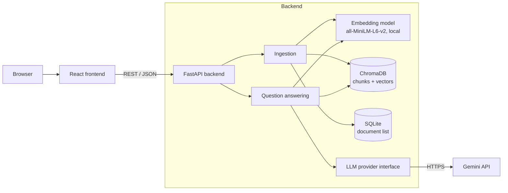

# DocChat

Chat with your PDFs. Upload lecture notes, slides or papers, ask questions in plain English, and get answers drawn only from your own documents, with citations to the source page.

DocChat is a retrieval-augmented generation (RAG) application built with React, FastAPI, sentence-transformers, ChromaDB and the Gemini API.

<!-- Replace with your own screenshot or GIF: docs/images/demo.gif -->


## Features

- **Upload PDFs** and have them extracted, chunked and embedded automatically.
- **Ask questions** across all documents, or limit the search to one.
- **Grounded answers with citations.** Every answer points to the document and page it came from, and each citation expands to show the source text.
- **Honest "not found" replies.** If the answer isn't in your documents, the app says so instead of answering from general knowledge.
- **Follow-up questions** such as "explain that more simply".
- **Persistent storage.** Documents are still there after a restart.
- **Clear error messages** for scanned PDFs, wrong file types, oversized files and rate limits.

## How it works



**Ingestion:** a PDF is validated, its text is extracted page by page, and each page is split into overlapping 800-character chunks that end at word boundaries. The chunks are embedded locally and stored in ChromaDB with their document and page number.

**Question answering:** the question is embedded with the same model, the 8 most similar chunks are retrieved, and they are sent to the LLM as numbered context with instructions to answer only from that context and cite passages like `[1]`. The backend maps each cited number back to its document and page. One LLM call is made per question.

## Tech stack

| Layer | Technology |
|---|---|
| Frontend | React, TypeScript, Vite |
| Backend | Python 3.12, FastAPI |
| PDF parsing | pypdf |
| Embeddings | sentence-transformers (`all-MiniLM-L6-v2`), run locally on CPU |
| Vector store | ChromaDB (persistent, local) |
| Metadata | SQLite |
| LLM | Google Gemini (`gemini-3.5-flash-lite`), behind a swappable provider interface |
| Testing | pytest, FastAPI TestClient |

## Getting started

### Prerequisites

- Python 3.11 or 3.12
- Node.js 18 or newer
- A Gemini API key from [Google AI Studio](https://aistudio.google.com)

### Backend

```bash
cd backend
python -m venv venv
venv\Scripts\activate          # macOS/Linux: source venv/bin/activate
pip install -r requirements.txt
copy .env.example .env         # macOS/Linux: cp .env.example .env
```

Open `backend/.env` and set `GEMINI_API_KEY`. Then start the server:

```bash
uvicorn app.main:app --reload
```

The API runs at `http://localhost:8000`, with interactive documentation at `http://localhost:8000/docs`. The first start downloads the embedding model (about 90 MB).

### Frontend

```bash
cd frontend
npm install
npm run dev
```

Open `http://localhost:5173`.

### Configuration

Settings live in `backend/.env`. See `backend/.env.example` for the full list.

| Variable | Default | Purpose |
|---|---|---|
| `GEMINI_API_KEY` | none | Required |
| `LLM_MODEL` | `gemini-3.5-flash-lite` | Gemini model used for answers |
| `CHUNK_SIZE` / `CHUNK_OVERLAP` | `800` / `150` | Chunking, in characters |
| `TOP_K` | `8` | Chunks retrieved per question |
| `MAX_UPLOAD_MB` | `20` | Upload size limit |

## Tests

```bash
cd backend
pytest -v
```

The suite has 71 tests covering extraction, chunking, embeddings, the vector store, the document repository, prompt building, citation parsing and every API endpoint. API tests use a fake LLM provider, so running them never calls Gemini or uses quota.

## API

| Method | Endpoint | Purpose |
|---|---|---|
| `POST` | `/api/documents` | Upload and ingest a PDF |
| `GET` | `/api/documents` | List documents |
| `DELETE` | `/api/documents/{id}` | Delete a document and its chunks |
| `POST` | `/api/ask` | Ask a question |
| `GET` | `/api/health` | Health check |

Errors share one shape: `{"error": {"code": "...", "message": "..."}}`.

## Project documentation

This project was run as a small software engineering process, and the documents are part of the repository.

| Document | Contents |
|---|---|
| [Project charter](docs/00-project-charter.md) | Problem, goals, non-goals, constraints, risks |
| [Requirements](docs/01-requirements.md) | User stories, functional and non-functional requirements, acceptance criteria |
| [System design](docs/02-design.md) | Architecture, pipelines, API, data model, prompt design |
| [Spike findings](docs/03-spike-findings.md) | Experiments that shaped the chunking, retrieval and prompt settings |
| [Project plan](docs/04-plan.md) | Milestones, issues, workflow |
| [Architecture decisions](docs/adr/) | Why Gemini Flash-Lite, ChromaDB, no orchestration framework, and the chunking strategy |

## Privacy

Uploaded PDFs, their text and their embeddings are stored locally on the machine running the backend. When you ask a question, the retrieved passages and your question are sent to the Gemini API to generate the answer. On Gemini's free tier, Google's terms may allow this content to be used to improve its products, so check the current Gemini API terms and avoid uploading confidential documents.

## Limitations

- **Text-based PDFs only.** Scanned PDFs are detected and rejected; there is no OCR.
- **Single user, no login.** All documents share one local store.
- **Not yet formally evaluated.** Behaviour was checked in a small spike (see [spike findings](docs/03-spike-findings.md)) and by automated tests, but retrieval and answer accuracy have not been measured on a larger question set.
- **Retrieval is the weakest component.** The small embedding model can rank agenda or reference pages above the page that holds the answer.
- **Follow-ups assume the same topic.** The previous question is added to the search, which can add noise when the topic changes.
- **Answers are shown as plain text**, so Markdown formatting from the model is not rendered.
- **Free-tier rate limits apply** (15 requests per minute and 500 per day when last checked, October 2026).

## Future work

- An evaluation set measuring retrieval hit rate, answer correctness and "not found" accuracy
- Hybrid (keyword plus vector) search or re-ranking
- A local LLM option for fully private use
- OCR for scanned PDFs, and support for `.docx` and `.txt`
- Markdown rendering and streaming answers
- User accounts

## Author

Malmi Wimalaweera · [GitHub](https://github.com/MalmEEE) · [LinkedIn](https://linkedin.com/in/malmi-wimalaweera-ba4071315)